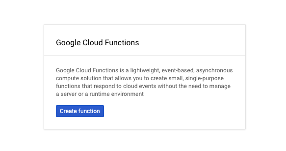

# Fully Managed Google Cloud Functions Sink connector


## Objective

Quickly test [Fully Managed Google Cloud Functions Sink](https://docs.confluent.io/cloud/current/connectors/cc-google-functions-sink.html#google-cloud-functions-sink-connector-for-ccloud) connector.


* Active Google Cloud Platform (GCP) account with authorization to create resources

## Google Cloud Functions Setup

* Navigate to the [Google Cloud Console](https://console.cloud.google.com/)

* Go to the [Cloud Functions](https://console.cloud.google.com/functions) tab.



* Create a new function. Use the default code that is provided.


Note down the project id, the region (example `us-central1`), and the function name (example `function-1`) as they will be used later.

## Prerequisites

All you have to do is to be already logged in with [confluent CLI](https://docs.confluent.io/confluent-cli/current/overview.html#confluent-cli-overview).

By default, a new Confluent Cloud environment with a Cluster will be created.

You can configure the cluster by setting environment variables:

* `CLUSTER_CLOUD`: The Cloud provider (possible values: `aws`, `gcp` and `azure`, default `aws`)
* `CLUSTER_REGION`: The Cloud region (use `confluent kafka region list` to get the list, default `eu-west-2` for aws, `westeurope`for azure and `europe-west2` for gcp)
* `CLUSTER_TYPE`: The type of cluster (possible values: `basic`, `standard` and `dedicated`, default `basic`)
* `ENVIRONMENT` (optional): The environment id where want your new cluster (example: `txxxxx`) 

In case you want to use your own existing cluster, you need to setup these environment variables:

* `ENVIRONMENT`: The environment id where your cluster is located (example: `txxxxx`) 
* `CLUSTER_NAME`: The cluster name
* `CLUSTER_CLOUD`: The Cloud provider (possible values: `aws`, `gcp` and `azure`)
* `CLUSTER_REGION`: The Cloud region (example `us-east-2`)
* `CLUSTER_CREDS`: The Kafka api key and secret to use, it should be separated with colon (example: `<API_KEY>:<API_KEY_SECRET>`)
* `SCHEMA_REGISTRY_CREDS` (optional, if not set, new one will be created): The Schema Registry api key and secret to use, it should be separated with colon (example: `<SR_API_KEY>:<SR_API_KEY_SECRET>`)


## How to run

Simply run:

```bash
$ just use <playground run> command and search for fully-managed-google-cloud-functions<use tab key to activate fzf completion (see https://kafka-docker-playground.io/#/cli?id=%e2%9a%a1-setup-completion), otherwise use full path, or correct relative path> <GCP_FUNCTION_REGION> <GCP_FUNCTION_FUNCTION> .sh in this folder
```
