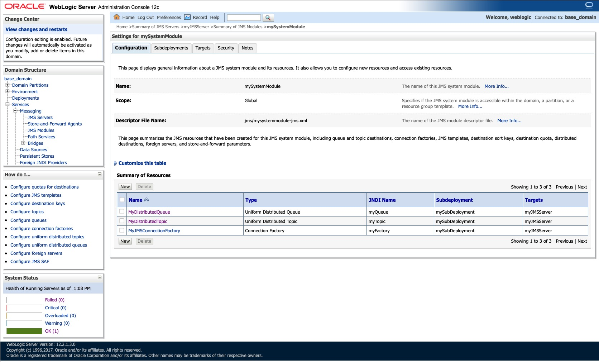

# Oracle Weblogic Source with JMS connector

## Objective

Quickly test [Oracle Weblogic](https://docs.confluent.io/current/connect/kafka-connect-jms/sink/index.html) with JMS connector.

Using Oracle WebLogic Server (Developer Tier, version `12.2.1.3`) Docker [image](https://container-registry.oracle.com). You need to register and acknoledge license terms and conditions to get the image.


## How to run

Simply run:

```
$ playground run -f jms-weblogic-source<use tab key to activate fzf completion (see https://kafka-docker-playground.io/#/cli?id=%e2%9a%a1-setup-completion), otherwise use full path, or relative path>
```

N.B: Weblogic console is reachable at [http://127.0.0.1:7001/console](http://127.0.0.1:7001/console]) (`weblogic`/`welcome1`)

You can use it to see all JMS resources:



## Details of what the script is doing

### Queue example

Creating JMS weblogic source connector

```bash
$ curl -X PUT \
     -H "Content-Type: application/json" \
     --data '{
               "connector.class": "io.confluent.connect.jms.JmsSourceConnector",
               "kafka.topic": "from-weblogic-messages",
               "java.naming.factory.initial": "weblogic.jndi.WLInitialContextFactory",
               "jms.destination.name": "myJMSServer/mySystemModule!myJMSServer@MyDistributedQueue",
               "jms.destination.type": "QUEUE",
               "java.naming.provider.url": "t3://weblogic-jms:7001",
               "connection.factory.name": "myFactory",
               "java.naming.security.principal": "weblogic",
               "java.naming.security.credentials": "welcome1",
               "key.converter": "org.apache.kafka.connect.storage.StringConverter",
               "value.converter": "org.apache.kafka.connect.storage.StringConverter",
               "tasks.max" : "1",
               "confluent.license": "",
               "confluent.topic.bootstrap.servers": "broker:9092",
               "confluent.topic.replication.factor": "1"
          }' \
     http://localhost:8083/connectors/weblogic-source/config | jq .
```

Sending one message in JMS queue myQueue:

```bash
$ docker exec jms-sender bash -c 'java -cp "/tmp/weblogic.jar:/tmp/wlthint3client.jar:/jms-sender-1.0.0.jar" com.sample.jms.toolkit.JMSSender'
````

Verify we have received the data in from-weblogic-messages topic

```bash
playground topic consume --topic from-weblogic-messages --min-expected-messages 1 --timeout 60
```

Results:

```
Struct{messageID=ID:<704504.1635434551285.0>,messageType=text,timestamp=1635434551285,deliveryMode=2,destination=Struct{destinationType=queue,name=mySystemModule!myJMSServer@MyDistributedQueue},redelivered=false,expiration=0,priority=4,properties={JMS_BEA_DeliveryTime=Struct{propertyType=long,long=1635434551285}, JMSXDeliveryCount=Struct{propertyType=integer,integer=1}},text=Hello Queue World!}
```


N.B: Control Center is reachable at [http://127.0.0.1:9021](http://127.0.0.1:9021])

