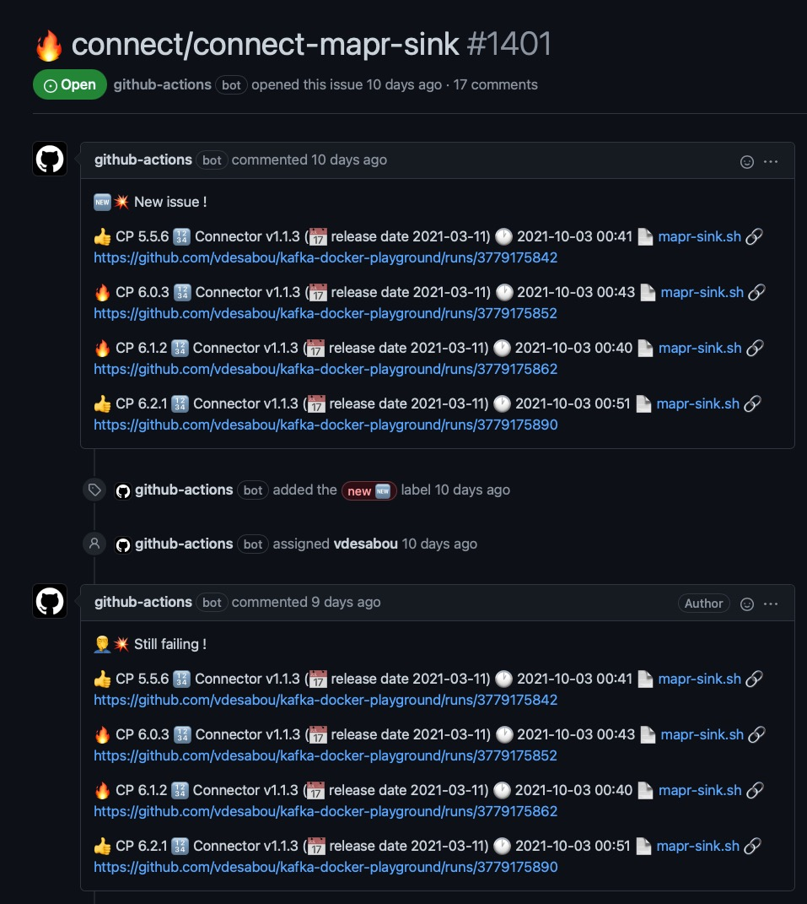

# 🎓️ How it works

Before learning how to create your own examples/reproduction models, here are some explanations on how the playground works internally:

## 📁 Folder structure

The main categories like `ccloud`, `connect`, `environment` are in root folder:

```
├── 3rdparty
├── ccloud
├── cloudformation
├── connect
├── docs
├── environment
├── images
├── ksqldb
├── operator
├── other
├── replicator
├── scripts
├── tools
└── troubleshooting
```

All the tests are and **must** be at second level.

Example with `connect`folder:

```
connect
├── connect-active-mq-sink
├── connect-active-mq-source
├── connect-amps-source
├── connect-appdynamics-metrics-sink
├── connect-aws-cloudwatch-logs-source
├── connect-aws-cloudwatch-metrics-sink
<snip>

131 directories
```

This is important because each test is sourcing [`scripts/utils.sh`](https://github.com/vdesabou/kafka-docker-playground/blob/master/scripts/utils.sh) like this:

```bash
DIR="$( cd "$( dirname "${BASH_SOURCE[0]}" )" >/dev/null && pwd )"
source ${DIR}/../../scripts/utils.sh
```

## 🐳 Docker override

The playground makes extensive use of docker-compose [override](https://docs.docker.com/compose/extends/) (i.e `docker-compose -f docker-compose1.yml -f docker-compose2.yml ...`).

Each test is built based on an [environment](#/content?id=%F0%9F%94%90-environments), [PLAINTEXT](https://github.com/vdesabou/kafka-docker-playground/tree/master/environment/plaintext) being the most common one.

> [!TIP]
> Check **[📝 See properties file](/how-to-use?id=📝-see-properties-file)** section, in order to see the end result properties file

Let's have a look at some examples to understand how it works:

### Connector using PLAINTEXT

Example with ([active-mq-sink.sh](https://github.com/vdesabou/kafka-docker-playground/blob/master/connect/connect-active-mq-sink/active-mq-sink.sh)):

```shell
${DIR}/../../environment/plaintext/start.sh "${PWD}/docker-compose.plaintext.yml"
```

The *local* [`${PWD}/docker-compose.plaintext.yml`](https://github.com/vdesabou/kafka-docker-playground/blob/master/connect/connect-active-mq-sink/docker-compose.plaintext.yml) is only composed of:

```yml
---
version: '3.5'
services:
  activemq:
    image: rmohr/activemq:5.15.9
    hostname: activemq
    container_name: activemq
    ports:
      - '61616:61616'
      - '8161:8161'

  connect:
    environment:
      CONNECT_PLUGIN_PATH: /usr/share/confluent-hub-components/confluentinc-kafka-connect-activemq-sink
```

It contains:

* `activemq` container required for the test 
* For `connect` container, it will override value `CONNECT_PLUGIN_PATH` from [`environment/plaintext/docker-compose.yml`](https://github.com/vdesabou/kafka-docker-playground/blob/master/environment/plaintext/docker-compose.yml)

PLAINTEXT is used thanks to the call to `${DIR}/../../environment/plaintext/start.sh`

> [!WARNING]
> The *local* docker-compose file should be named docker-compose.%environment%[.%optional'%].yml 
> 
> Example: 
> 
> `docker-compose.plaintext.yml` or `docker-compose.plaintext.mtls.yml`
> 
> This is required for [stop.sh](https://github.com/vdesabou/kafka-docker-playground/blob/master/connect/connect-active-mq-sink/stop.sh) script to work properly.


### Environment SASL/SSL 

Environments are also overriding [PLAINTEXT](https://github.com/vdesabou/kafka-docker-playground/tree/master/environment/plaintext), so for example [SASL/SSL](https://github.com/vdesabou/kafka-docker-playground/tree/master/environment/sasl-ssl) has a [docker-compose.yml](https://github.com/vdesabou/kafka-docker-playground/blob/master/environment/sasl-ssl/docker-compose.yml) file like this:

```yml
  ####
  #
  # This file overrides values from environment/plaintext/docker-compose.yml
  #
  ####

  zookeeper:
    environment:
      KAFKA_OPTS: -Djava.security.auth.login.config=/etc/kafka/secrets/zookeeper_jaas.conf
                  -Dzookeeper.authProvider.1=org.apache.zookeeper.server.auth.SASLAuthenticationProvider
                  -DrequireClientAuthScheme=sasl
                  -Dzookeeper.allowSaslFailedClients=false
    volumes:
      - ../../environment/sasl-ssl/security:/etc/kafka/secrets

  broker:
    volumes:
      - ../../environment/sasl-ssl/security:/etc/kafka/secrets
    environment:
      KAFKA_INTER_BROKER_LISTENER_NAME: SASL_SSL
      KAFKA_LISTENER_SECURITY_PROTOCOL_MAP: SASL_SSL:SASL_SSL
      KAFKA_ADVERTISED_LISTENERS: SASL_SSL://broker:9092
      KAFKA_LISTENERS: SASL_SSL://:9092
      CONFLUENT_METRICS_REPORTER_SECURITY_PROTOCOL: SASL_SSL
      CONFLUENT_METRICS_REPORTER_SASL_JAAS_CONFIG: "org.apache.kafka.common.security.plain.PlainLoginModule required \
        username=\"client\" \
        password=\"client-secret\";"
      CONFLUENT_METRICS_REPORTER_SASL_MECHANISM: PLAIN
      CONFLUENT_METRICS_REPORTER_SSL_TRUSTSTORE_LOCATION: /etc/kafka/secrets/kafka.client.truststore.jks
      CONFLUENT_METRICS_REPORTER_SSL_TRUSTSTORE_PASSWORD: confluent
      CONFLUENT_METRICS_REPORTER_SSL_KEYSTORE_LOCATION: /etc/kafka/secrets/kafka.client.keystore.jks
      CONFLUENT_METRICS_REPORTER_SSL_KEYSTORE_PASSWORD: confluent
      CONFLUENT_METRICS_REPORTER_SSL_KEY_PASSWORD: confluent
      KAFKA_SASL_ENABLED_MECHANISMS: PLAIN
      KAFKA_SASL_MECHANISM_INTER_BROKER_PROTOCOL: PLAIN
      KAFKA_SSL_KEYSTORE_FILENAME: kafka.broker.keystore.jks
      KAFKA_SSL_KEYSTORE_CREDENTIALS: broker_keystore_creds
      KAFKA_SSL_KEY_CREDENTIALS: broker_sslkey_creds
      KAFKA_SSL_TRUSTSTORE_FILENAME: kafka.broker.truststore.jks
      KAFKA_SSL_TRUSTSTORE_CREDENTIALS: broker_truststore_creds
      # enables 2-way authentication
      KAFKA_SSL_CLIENT_AUTH: "required"
      KAFKA_SSL_ENDPOINT_IDENTIFICATION_ALGORITHM: "HTTPS"
      KAFKA_OPTS: -Djava.security.auth.login.config=/etc/kafka/secrets/broker_jaas.conf
      KAFKA_SSL_PRINCIPAL_MAPPING_RULES: RULE:^CN=(.*?),OU=TEST.*$$/$$1/,DEFAULT

      <snip>
```

It only contains what is required to add SASL/SSL to a PLAINTEXT environment 💫 !

### Connector using SASL/SSL

Example with ([gcs-sink-sasl-ssl.sh](https://github.com/vdesabou/kafka-docker-playground/blob/master/connect/connect-gcp-gcs-sink/gcs-sink-sasl-ssl.sh)):

```shell
${DIR}/../../environment/sasl-ssl/start.sh "${PWD}/docker-compose.sasl-ssl.yml""
```

The *local* [`${PWD}/docker-compose.sasl-ssl.yml`](https://github.com/vdesabou/kafka-docker-playground/blob/master/connect/connect-gcp-gcs-sink/docker-compose.sasl-ssl.yml) is only composed of:

```yml
version: '3.5'
services:
  connect:
    volumes:
        - ../../connect/connect-gcp-gcs-sink/keyfile.json:/tmp/keyfile.json:ro
        - ../../environment/sasl-ssl/security:/etc/kafka/secrets
    environment:
      CONNECT_PLUGIN_PATH: /usr/share/confluent-hub-components/confluentinc-kafka-connect-gcs
```

> [!TIP]
> [connect-gcp-gcs-sink](https://github.com/vdesabou/kafka-docker-playground/tree/master/connect/connect-gcp-gcs-sink) example contains various examples with security [gcs-sink-2way-ssl.sh](https://github.com/vdesabou/kafka-docker-playground/blob/master/connect/connect-gcp-gcs-sink/gcs-sink-2way-ssl.sh), [gcs-sink-kerberos.sh](https://github.com/vdesabou/kafka-docker-playground/blob/master/connect/connect-gcp-gcs-sink/gcs-sink-kerberos.sh), [gcs-sink-ldap-authorizer-sasl-plain.sh](https://github.com/vdesabou/kafka-docker-playground/blob/master/connect/connect-gcp-gcs-sink/gcs-sink-ldap-authorizer-sasl-plain.sh) or even RBAC [gcs-sink-rbac-sasl-plain.sh](https://github.com/vdesabou/kafka-docker-playground/blob/master/connect/connect-gcp-gcs-sink/gcs-sink-rbac-sasl-plain.sh)

# 👷‍♂️ Build your example

## 👍️ Examples

### 🔓️ Plaintext example

### 🔒️ Security example

## 🔃 Re-create containers

Because the playground use **[Docker override](/how-it-works?id=🐳-docker-override)**, not all configuration parameters are in same `docker-compose.yml` file and docker-compose files in the playground depends on environment variables to be set.

For these reasons, if you want to make a change in one of the docker-compose files (without restarting the test from scratch), it is not simply a matter of doing `docker-compose up -d` 😀

However, when you execute a test, you'll have in the output the command to run in order to easily re-create modified container(s), see an example:

```bash
12:02:18 ℹ️ ⚡If you modify a docker-compose file 
and want to re-create the container(s), use this command:
12:02:18 ℹ️ ⚡source ../../scripts/utils.sh && docker-compose -f ../../environment/plaintext/docker-compose.yml -f /Users/vsaboulin/Documents/github/kafka-docker-playground/connect/connect-http-sink/docker-compose.plaintext.yml --profile control-center up -d
```

So you can modify one of the docker-compose files (in that case either `environment/plaintext/docker-compose.yml` or `connect/connect-http-sink/docker-compose.plaintext.yml`), and then run the suggested command:

Example:

I've edited `connect/connect-http-sink/docker-compose.plaintext.yml` and updated both `connect` and `http-service-no-auth`, and then I execute the suggested command:

```bash
$ source ../../scripts/utils.sh && docker-compose -f ../../environment/plaintext/docker-compose.yml -f /Users/vsaboulin/Documents/github/kafka-docker-playground/connect/connect-http-sink/docker-compose.plaintext.yml --profile control-center  up -d
http-service-ssl-basic-auth is up-to-date
http-service-oauth2-auth is up-to-date
Recreating http-service-no-auth ... 
zookeeper is up-to-date
http-service-no-auth-500 is up-to-date
http-service-mtls-auth is up-to-date
http-service-basic-auth-204 is up-to-date
http-service-basic-auth is up-to-date
broker is up-to-date
Recreating http-service-no-auth ... done
Recreating connect              ... done
control-center is up-to-date
```

# 🥽 Deep dive

## 🤖 How CI works

Everyday, regression tests are executed using [Github Actions](https://github.com/features/actions). 

The workflow runs are available [here](https://github.com/vdesabou/kafka-docker-playground/actions).

The CI is defined using [`.github/workflows/run-regression.yml`](https://github.com/vdesabou/kafka-docker-playground/blob/master/.github/workflows/run-regression.yml) file (see the list of tests executed [here](https://github.com/vdesabou/kafka-docker-playground/blob/fbc009be503d7c0c55a16ddf17679d50f721c74f/.github/workflows/run-regression.yml#L46-L84))

> [!NOTE]
> CI is executed on Ubuntu 20.04 on Azure, see [documentation](https://docs.github.com/en/actions/using-github-hosted-runners/about-github-hosted-runners#supported-runners-and-hardware-resources)

A test is executed if:

* it was failing in the last run
* a change has been made in the test directory
* CP or connection has changed
* last execution was more than 7 days ago

If a test is failing, a Github issue will be automatically opened or updated with results for each CP version.

Example:

Issue [#1401](https://github.com/vdesabou/kafka-docker-playground/issues/1401):



The Github issue will be automatically closed when all results for a test are ok:

Example:


CI results are present in **[Content](/content.md)** section:

Example:


> [!TIP]
> * When the test is successful, the badge looks like [](https://github.com/vdesabou/kafka-docker-playground/runs/3875670630) and clicking on it brings you to the CI run
> 
> * When the test is failing for **all** tested CP versions, the badge looks like [](https://github.com/vdesabou/kafka-docker-playground/issues/935) and clicking on it brings you to the corresponding Github issue
> 
> * When the test is failing for **just some** tested CP versions, the badge looks like [](https://github.com/vdesabou/kafka-docker-playground/issues/778) and clicking on it brings you to the corresponding Github issue
> 
> * When a test cannot be tested in CI, the badge  is set (without any associated link)

> [!TIP]
> * Clicking on the connector version badge [](https://docs.confluent.io/kafka-connect-aws-dynamodb/current/index.html) brings you to the corresponding documentation page
