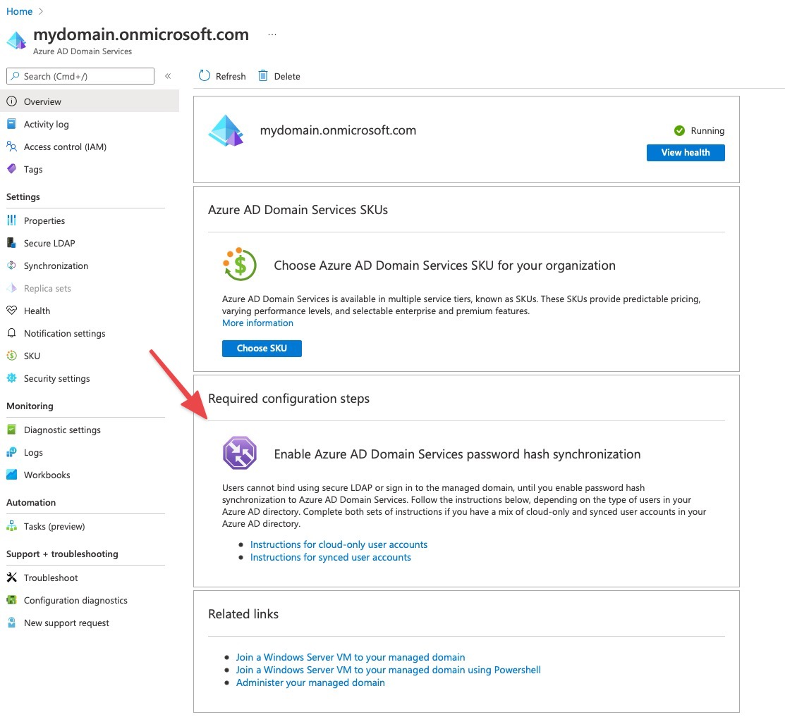
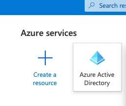
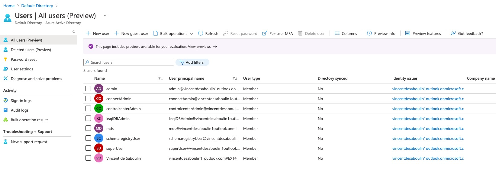
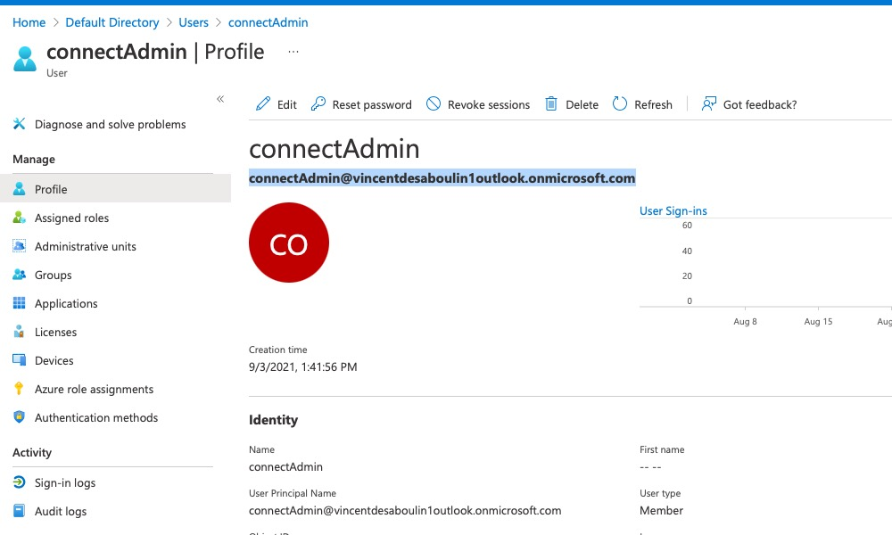
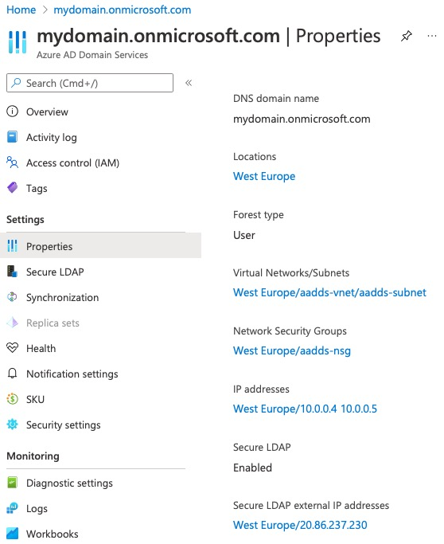

# Testing Azure AD with RBAC

LDAP authentication with Azure Active Directory can be setup, see the documentation [here](https://docs.microsoft.com/en-us/azure/active-directory/fundamentals/auth-ldap)

Here are some notes on the setup:

I've created an Azure account (Pay As You Go) because I could not use my confluent account since a requirement is `You need global administrator privileges in your Azure AD tenant to configure Azure AD DS`

This is the pricing for [Azure Active Directory Domain Services](https://azure.microsoft.com/en-us/pricing/details/active-directory-ds/)

## Create and configure an Azure AD DS instance

See full tutorial doc [here](https://docs.microsoft.com/en-us/azure/active-directory-domain-services/tutorial-create-instance)

### [Create a managed domain](https://docs.microsoft.com/en-us/azure/active-directory-domain-services/tutorial-create-instance#create-a-managed-domain)

I followed https://docs.microsoft.com/en-us/azure/active-directory-domain-services/tutorial-create-instance

I created a new Resource Group
I used *Standard* SKU and domain `mydomain` (Built-in domain name) which gives in the end `mydomain.onmicrosoft.com`
The forest should be User

### [Deploy the managed domain](https://docs.microsoft.com/en-us/azure/active-directory-domain-services/tutorial-create-instance#deploy-the-managed-domain)

It took almost one hour to deploy !

### [Update DNS settings for the Azure virtual network](https://docs.microsoft.com/en-us/azure/active-directory-domain-services/tutorial-create-instance#update-dns-settings-for-the-azure-virtual-network)

I followed all the steps

### [Enable user accounts for Azure AD DS](https://docs.microsoft.com/en-us/azure/active-directory-domain-services/tutorial-create-instance#enable-user-accounts-for-azure-ad-ds)

I used only Cloud only users.
This part of the documentation is confusing and also the message in UI:



When using cloud only users, you only need to know the following:

* Create a new user by going to Azure Active Directory



* Create users



* Login with each other to azure portal using `User Principal Name`

For example `connectAdmin@vincentdesaboulin1outlook.onmicrosoft.com` and the password. You'll be prompted to change your password



**THIS IS MANDATORY TO CHANGE PASSWORD!!**

I did not follow next 3 steps and directly did "Configure secure LDAP"

## [Configure secure LDAP](https://docs.microsoft.com/en-us/azure/active-directory-domain-services/tutorial-configure-ldaps)

### [Create a certificate for secure LDAP](https://docs.microsoft.com/en-us/azure/active-directory-domain-services/tutorial-configure-ldaps#create-a-certificate-for-secure-ldap)

For this, I started a Windows Server 2019 EC2 instance to generate the certs.

### [Export a certificate for Azure AD DS](https://docs.microsoft.com/en-us/azure/active-directory-domain-services/tutorial-configure-ldaps#export-a-certificate-for-azure-ad-ds) and [Export a certificate for client computers](https://docs.microsoft.com/en-us/azure/active-directory-domain-services/tutorial-configure-ldaps#export-a-certificate-for-client-computers)

This was straightforward, I exported two certs exactly as explained: cert.pfx and cert.cer

### [Enable secure LDAP for Azure AD DS](https://docs.microsoft.com/en-us/azure/active-directory-domain-services/tutorial-configure-ldaps#enable-secure-ldap-for-azure-ad-ds)

This was straightforward

### [Lock down secure LDAP access over the internet](https://docs.microsoft.com/en-us/azure/active-directory-domain-services/tutorial-configure-ldaps#lock-down-secure-ldap-access-over-the-internet)

This was straightforward

### [Configure DNS zone for external access](https://docs.microsoft.com/en-us/azure/active-directory-domain-services/tutorial-configure-ldaps#configure-dns-zone-for-external-access)



My ip was `20.86.237.230`
Note: The `etc/hosts` part is done automatically in the `start.sh` script


## Run the script

Once all steps above were done and my Azure AD users created with new passwords, I was able to run the start.sh script

Here is what is done:

Create `truststore.jks` from `cert.cer`:

```
# https://docs.oracle.com/cd/E35976_01/server.740/es_admin/src/tadm_ssl_convert_pem_to_jks.html
keytool -genkey -keyalg RSA -alias endeca -keystore truststore.jks -noprompt -storepass confluent -keypass confluent -dname 'CN=broker,C=US'
keytool -delete -alias endeca -keystore truststore.jks -noprompt -storepass confluent -keypass confluent
keytool -import -v -trustcacerts -alias endeca-ca -file cert.cer -keystore truststore.jks -noprompt -storepass confluent -keypass confluent
```

Add the FQDN of LDAP server to broker `/etc/hosts`:

```
docker exec  --privileged --user root -i broker bash -c 'echo "20.86.237.230 ldaps.mydomain.onmicrosoft.com" >> /etc/hosts'
```

The broker config contains in particular:

```yml
# Configure MDS to talk to AD/LDAP
KAFKA_LDAP_JAVA_NAMING_FACTORY_INITIAL: com.sun.jndi.ldap.LdapCtxFactory
KAFKA_LDAP_COM_SUN_JNDI_LDAP_READ_TIMEOUT: 3000
KAFKA_LDAP_JAVA_NAMING_PROVIDER_URL: ldaps://ldaps.mydomain.onmicrosoft.com:636
# Authenticate to LDAP
KAFKA_LDAP_JAVA_NAMING_SECURITY_PRINCIPAL: CN=admin,OU=AADDC Users,DC=mydomain,DC=onmicrosoft,DC=com
KAFKA_LDAP_JAVA_NAMING_SECURITY_CREDENTIALS: Sugt5676
KAFKA_LDAP_JAVA_NAMING_SECURITY_AUTHENTICATION: simple
KAFKA_LDAP_JAVA_NAMING_SECURITY_PROTOCOL: SSL
KAFKA_LDAP_SSL_TRUSTSTORE_LOCATION: /tmp/truststore.jks
KAFKA_LDAP_SSL_TRUSTSTORE_PASSWORD: confluent

# How to locate users and groups
KAFKA_LDAP_SEARCH_MODE: USERS
KAFKA_LDAP_USER_SEARCH_BASE: OU=AADDC Users,DC=mydomain,DC=onmicrosoft,DC=com
KAFKA_LDAP_USER_NAME_ATTRIBUTE: cn
KAFKA_LDAP_USER_OBJECT_CLASS: user
KAFKA_LDAP_USER_MEMBEROF_ATTRIBUTE: memberOf
KAFKA_LDAP_USER_MEMBEROF_ATTRIBUTE_PATTERN: "CN=(.*),OU=AADDC Users,.*"
```

And it worked 🥳:


